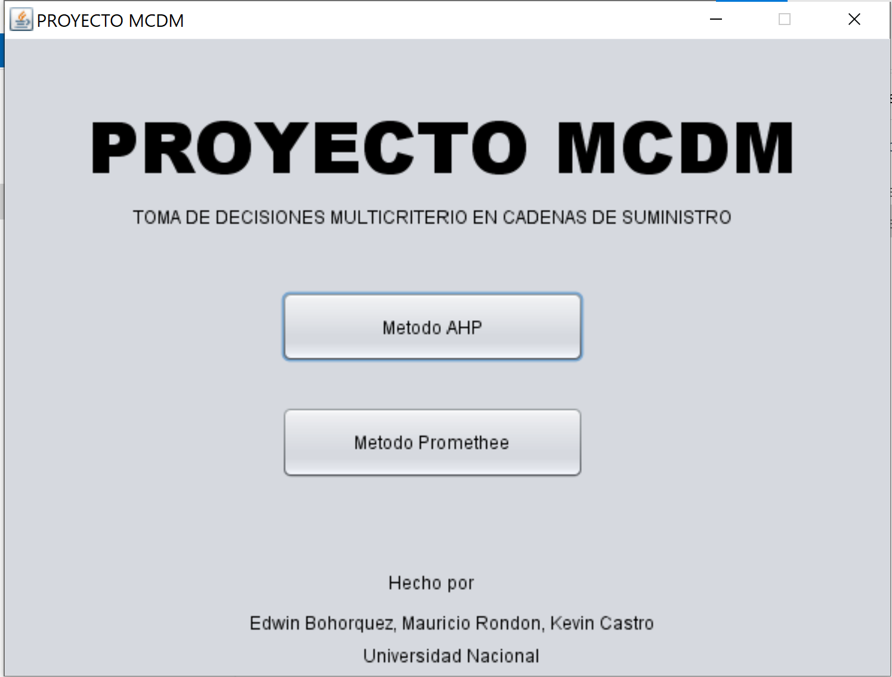
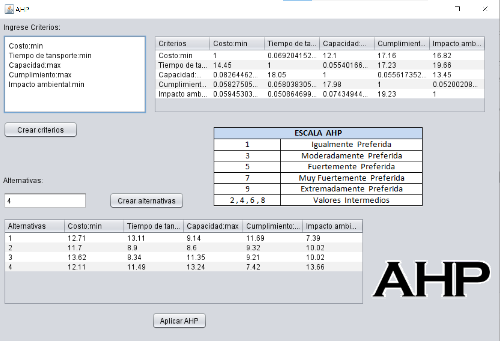
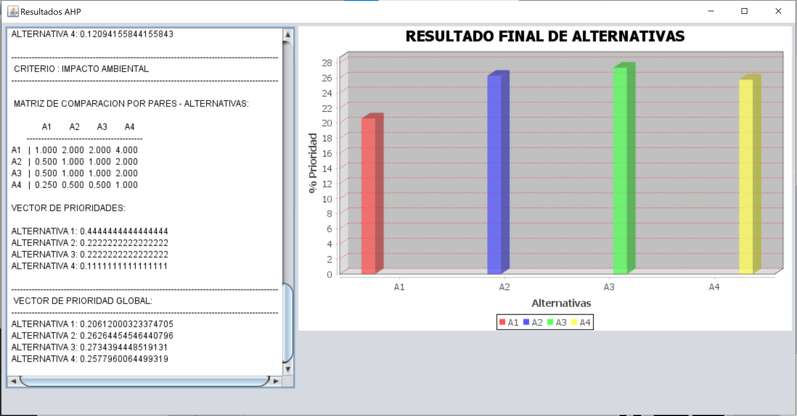
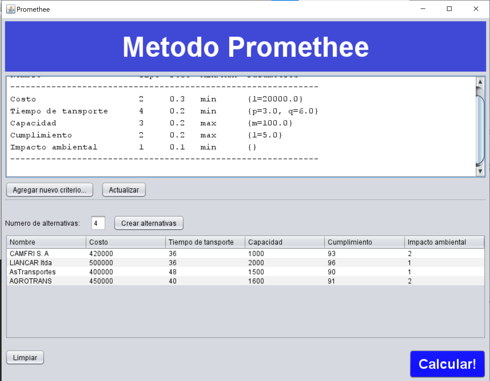
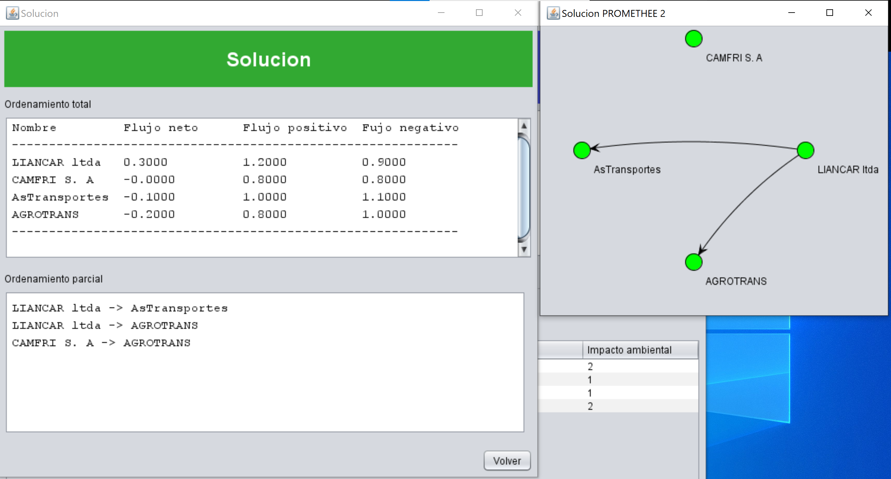

# Multi objective optimization tool

This tools implements two different methods for choosing the best option given a set of different objectives. It has two different algorithms, AHP and Promehtee.

### Download

You can find the download files on our releases or find in this [link](https://github.com/amrondonp/MultiObjetiveOptimization/releases)

### Screenshots

Main menu

AHP input

AHP result

Promethee input

Promethee result

